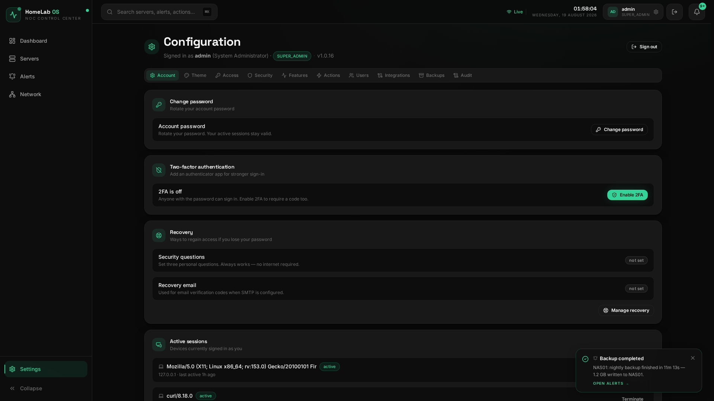

<p align="center">
  
</p>

<h1 align="center">HomeLab OS</h1>

<p align="center">
  A premium, production-quality <b>self-hosted Infrastructure Operating System</b> — a live
  Network Operations Center (NOC) dashboard for your homelab. Not a homepage, not a link-aggregator.
  A real-time observability surface with animated telemetry, optional hardware sensors, and an
  architecture designed to swap mock data for real integrations (Proxmox, Docker, Uptime Kuma,
  Node Exporter, Prometheus) without redesign.
</p>

<p align="center">
  <b>v1.0.17</b> ·
  
  
  
</p>

---

## Demo / Mock Mode

When running in mock mode (`MOCK_MODE=true`, the default), the dashboard boots with a demo account:

> **Username:** `admin`
> **Password:** `homelab-demo`

The settings page will display a blurred background with a login popup overlay. Sign in to access configuration. The dashboard renders a simulated 6-host fleet with realistic telemetry — no Proxmox or Docker connection required.

---

## Screenshots

| | |
| --- | --- |
|  |  |
|  |  |
|  |  |

---

## Screens

| Route | Purpose |
| --- | --- |
| `/` | **Dashboard** — greeting, live clock, infrastructure health score, 8 quick-stat cards (Nodes, Online, VMs/CTs, CPU, Memory, Download, Upload, Uptime), quick actions, animated network map, hosts panel with scroll, recent alerts, server overview with Docker profile cards |
| `/servers` | Fleet grid with per-server animated sparklines, Docker container profile cards per VM |
| `/servers/:id` | Server detail — locked header card format, 4 live metric cards, per-metric line graphs (CPU, Memory, Storage, Temperature, Network), resource breakdown, network throughput, hardware telemetry |
| `/alerts` | Full notification feed with severity filters and read state |
| `/network` | Topology, link table (latency/throughput/loss/jitter) with aggregate split download/upload, and host inventory |
| `/settings` | Access, security, features, quick actions, users, integrations, backups, audit log, account, and **Theme** — login modal overlay with blurred background when unauthenticated |

Global **search (⌘K / Ctrl+K)** reaches servers, alerts and quick actions from anywhere.

---

## What's New in v1.0.17

### New Features
- **8-card QuickStats layout** — split Internet Speed into Download and Upload cards with directional arrows; VMs & CTs shown as a single split card with internal divider
- **Realtime network bandwidth** — reads Linux `/proc/net/dev` every 3 seconds for live download/upload throughput on the dashboard
- **Docker Profile Cards** — per-VM cards showing container list, status, image, ports, bandwidth, container count, and a Details link; scrollable when container count exceeds card height
- **Docker02 host support** — second Docker VM fully modeled in mock data with 10 containers (jellyfin, uptime-kuma, prometheus, grafana, etc.), appears in Hosts panel and Network Map
- **Docker Host API endpoint** — `GET /api/docker/hosts` returns per-host container profiles with IP resolution
- **Docker Container API endpoint** — `GET /api/docker/containers` returns flat container list with port mappings
- **Login modal overlay** — settings page shows blurred background with centered login popup when unauthenticated; blur dissolves on successful login
- **Per-metric line graphs on server detail** — individual CPU, Memory, Storage, Temperature, and Network charts with time range selector, replacing the single tabbed chart
- **Locked server detail header card** — consistent 2-column grid layout across all servers regardless of role or data
- **Hosts panel scroll** — device list scrolls when it exceeds the left-column height (Infrastructure Health + Quick Actions); no scrollbar when devices fit
- **Aggregate throughput split** — Hosts panel and Network page show split Download ↑ / Upload ↓ instead of combined throughput
- **Docker02 server profile** — full CPU, RAM, storage, sensors, and simulation profile for the second Docker host

### Fixes
- **Uptime font color** — explicit `text-text-primary` on each uptime number span to match other cards
- **VM guest labels** — ServerCard bottom row shows "CTs" instead of "VMs" for VM guests (children with `parentId`)
- **Docker notification dispatch** — `index.ts` restructured with direct `dispatchNotification()` helper that calls `notifications.ingest()` + `notifyDispatcher` + `wsBroadcast()` instead of relying on broken provider chaining
- **WebSocket broadcast** — `attachWebSocket` now returns `WsHandles` with explicit `broadcastNotifications()` method
- **Network Map cable duplication** — `LinkLayer` collapses second curve when link is critical/offline to prevent duplicate cables
- **Docker Host uptime persistence** — `dockerMetricsProvider.ts` stores `startedAt` in settings DB with 30-day max age so uptime survives backend restarts
- **Host IP resolution** — `getHostIp()` utility uses `os.networkInterfaces()` to populate the Docker host spec IP field
- **Demo credentials** — always reset to `admin / homelab-demo` on every backend start in mock mode, preventing stale password mismatches
- **404 badge error** — removed broken image references from README screenshot table

### Changes
- QuickStats type extended with optional `value2`, `label2`, `unit2` for split display cards
- Mock fleet expanded from 5 to 6 hosts (added Docker02 with full server spec and sensor array)
- Mock Docker profiles: docker02 has 10 containers, docker01 has none
- Login page route (`/login`) redirects to `/settings` — login is now a modal overlay, not a separate page
- `LoginPage.tsx` deprecated in favor of `LoginModal.tsx` component
- `RequireAuth` shows blurred content + login popup for anonymous users instead of redirecting to a blank login page
- Server detail page `MetricChart` range selector syncs across all per-metric charts
- Docker container list includes port mappings extracted from Docker API response

---

## Tech Stack

**Frontend** — React 18 · TypeScript · Vite · TailwindCSS · Framer Motion · TanStack Query · Apache ECharts · React Router · Lucide Icons · Zustand

**Backend** — Node.js · Express · `ws` (WebSocket) · `better-sqlite3`

**Deploy** — Docker + docker-compose, nginx reverse proxy for SPA + API + WS

---

## Design Language

A dark, premium NOC aesthetic:

- Background `#0A0A0A`, cards `#181818`, subtle borders, huge whitespace
- **Theme system** — Dark (default) and Light appearances plus six saturated accents:
  **Green** (default `#34D399`), Purple, Blue, Orange, Red, Pink. Persisted locally; status colors
  (`success` / `warning` / `critical`) always stay semantic regardless of the chosen accent
- Inter + Space Grotesk + JetBrains Mono, soft shadows, soft glow, rounded corners
- Everything animates: numbers count up, charts tween, cards hover, statuses fade, updates arrive every **2 s** over WebSocket — never a hard jump
- Settings mutations open centered popup modals (create / edit / delete / credentials / security) — the Settings page stays a clean, scannable overview

---

## Architecture

```
┌────────────────────────────┐        ┌────────────────────────────────────────┐
│   Frontend (Vite + React)   │        │             Backend (Express)           │
│                             │  REST  │                                        │
│  pages · components         │◀──────▶│  routes/  (servers · stats · history   │
│  store/  (zustand)          │        │           · network · notifications ·  │
│  api/    (client · ws)      │        │           · search · health · admin ·  │
│  lib/sensors (registry)     │  WS    │           · agent)                    │
│  charts  (ECharts)          │◀──────▶│  ws/  ── broadcast every 2 s ──┐       │
└────────────────────────────┘        │  providers/  (abstraction)      │       │
                                      │    └─ ProxmoxMetricsProvider    │       │
                                      │    └─ MockMetricsProvider       │       │
┌────────────────────────────┐        │  telemetry/engine (simulation) ──┘       │
│   HomeLab Agent (optional)  │  REST  │  telemetry/notification-generator       │
│                             │───────▶│  db/ (SQLite · history + notifications) │
│  6 plugins: Linux, Docker,  │  auth  │  security/  (auth · 2FA · SMTP · locks) │
│  Proxmox, Sensors, SMART,   │        │  services/  (networkBandwidth reader)   │
│  Network                    │        └────────────────────────────────────────┘
│  per-plugin poll intervals  │
│  capability-based reporting │
└────────────────────────────┘
```

### Live data flow

1. On load the frontend hydrates from `GET /api/servers` and `GET /api/notifications`.
2. A **WebSocket** (`/ws`) pushes `{ type: 'telemetry', data: MetricSnapshot[] }` every 2 s and `{ type: 'notifications', data: Notification[] }` when events fire.
3. Snapshots update the zustand store; sparkline ring-buffers append; every value is animated via Framer Motion.
4. Historical charts read `GET /api/servers/:id/history?range=15m|1h|6h|24h` (SQLite, bucketed).
5. Network bandwidth is read from `/proc/net/dev` every 3 seconds and pushed via QuickStats.

### How servers are discovered — agent optional

HomeLab OS is **pull-based**: the backend asks infrastructure APIs directly. The core dashboard
works with **no agent installed** on your hosts. Discovery is entirely a backend concern:

- `MetricsProvider` (`backend/src/providers/types.ts`) is the single contract for data:
  servers, history, global health, stats and network topology.
- The default `MockMetricsProvider` returns a believable 6-host fleet (PVE0, Docker01, Docker02, NAS01, Gateway, Switch01)
  so the whole UI works out of the box.
- **Proxmox VE is a first-class live provider** (`backend/src/providers/proxmoxMetricsProvider.ts`). Set
  `MOCK_MODE=false` and provide a Proxmox API token (see `SETUP.md`). The backend then discovers every node,
  VM and container automatically and feeds the dashboard with real CPU/RAM/disk/network/temperature data —
  including optional `lm-sensors` telemetry when the host exposes it. Nothing is installed on Proxmox itself.
- **[HomeLab Agent](https://github.com/johnvexcoder/HomeLab-Agent)** (optional) adds node-local telemetry
  that the Proxmox API does not expose: CPU temperature, fan speeds, SMART disk health, Docker containers,
  kernel information, local services, UPS status, and more. The backend merges agent data with Proxmox API
  data into a single unified model. The agent is a separate repository.
- Other backends (Docker Engine API, Node Exporter, Uptime Kuma…) can implement the same `MetricsProvider`
  contract; the REST + WebSocket pipeline, fleet grid, charts, network map and alerts all stay identical.

---

## Hardware Telemetry (optional sensors)

The platform models sensors as **optional capabilities** — the UI must never show fabricated `0` or placeholder values.

- Each server declares the sensors it actually exposes (`spec.sensors` in `backend/src/mock-data/servers.ts`).
- The engine simulates them per tick (fan RPM tracks temperature, power tracks CPU, GPU sensors on `PVE0` only, etc.) and occasionally simulates a **read failure** (`available: false`).
- The frontend renders the **full sensor registry** (`frontend/src/lib/sensors.ts`) in a fixed grid, grouped by *GPU / Cooling / Power / Storage / Chipset*.
  - Sensor present + live → animated value with warning/critical coloring from the sensor's own thresholds.
  - Sensor present but failed → **"Unavailable"**.
  - Sensor not declared by the host → **"Not Available"** — same tile, same layout, no reflow.

Adding a sensor type in a future release is one entry in `SENSOR_REGISTRY` + one `SensorConfig` on the servers that have it. The panel design never changes.

---

## Getting Started

### Prerequisites
- Node.js ≥ 20, npm ≥ 9

### Development (both apps, hot reload)

```bash
npm install
npm run dev
```

- Frontend: http://localhost:5173 (proxies `/api` and `/ws` to backend)
- Backend: http://localhost:4000 · WebSocket: `ws://localhost:4000/ws`

Or run them separately: `npm run dev -w backend` / `npm run dev -w frontend`.

> Note: the backend has **no hot reload**. After editing backend code, restart it with
> `npx tsx src/index.ts` from `backend/`.

### Production build

```bash
npm run build        # tsc + vite build for both apps
npm run start -w backend
```

---

## Homelab Deployment Guide

> **For a complete, step-by-step installation walkthrough** — including Proxmox API token setup,
> enabling the live provider, Telegram and email configuration, and going live — read [`SETUP.md`](./SETUP.md).

### 1. Docker Compose (recommended)

```bash
docker compose up --build -d
```

- Frontend: http://localhost:3000 (nginx serves the SPA and proxies `/api` + `/ws`)
- Backend: http://localhost:4000
- SQLite volume `homelab-data` persists history, notifications, backups and settings

### 2. Reverse proxy + HTTPS

Put nginx (or Caddy / Traefik) in front and terminate TLS. The frontend container already serves the SPA
and proxies `/api` + `/ws`, so you only need to forward the hostname:

```nginx
server {
    listen 443 ssl http2;
    server_name dashboard.example.com;

    ssl_certificate     /etc/letsencrypt/live/dashboard.example.com/fullchain.pem;
    ssl_certificate_key /etc/letsencrypt/live/dashboard.example.com/privkey.pem;

    location / {
        proxy_pass http://127.0.0.1:3000;
        proxy_set_header Host $host;
        proxy_set_header X-Forwarded-For $proxy_add_x_forwarded_for;
        proxy_set_header X-Forwarded-Proto $scheme;

        # WebSocket upgrade for live telemetry
        proxy_http_version 1.1;
        proxy_set_header Upgrade $http_upgrade;
        proxy_set_header Connection "upgrade";
    }
}
```

When serving over HTTPS set `NODE_ENV=production` and `COOKIE_SECURE=true` on the backend.

### 3. First sign-in

In mock/demo mode the default credentials are:

> **Username:** `admin`
> **Password:** `homelab-demo`

In production mode, on first boot the backend creates a **super admin** and writes its credentials to
`DATA_DIR/.admin-initial-password` (e.g. `admin / <generated-password>`). Sign in at `/settings`.
To pin your own password instead, set `ADMIN_INITIAL_PASSWORD` in the backend environment.

### 4. Telegram notifications

- **Configuration → Integrations → New → Telegram**
- Enable the `telegram_notifications` feature flag first if it is not already on
  (**Configuration → Features**).
- Enter a name, bot token (stored **encrypted** — never returned to the UI) and chat ID.
- Use **Test** to verify the stored credentials.

> **Status:** the Telegram integration stores credentials safely and supports connection testing,
> but actual message delivery is under development. It is listed as a supported integration kind and
> gated behind its feature flag — treat delivery as a roadmap item.

### 5. SMTP email (verification codes + recovery)

- **Configuration → Integrations → New → Email** (feature flag `email_notifications`).
- Configure the SMTP server (host, port, user, password, from-address).
- Users with an email address can then receive OTP verification codes and account-recovery emails
  (2FA must be enabled and SMTP must be configured).

> **Status:** SMTP settings are also manageable as a security setting; the built-in dependency-free
> SMTP client supports plaintext, implicit TLS (465) and STARTTLS (587).

### 6. Going live with real servers

Follow `SETUP.md` to enable the **built-in Proxmox VE provider**: set `MOCK_MODE=false`, create an API token
in the Proxmox web UI, and drop the host + token into `.env`. The backend then discovers all nodes, VMs and
containers automatically — there is no agent component to deploy on your hosts. Everything else (fleet grid,
charts, network map, sensors, alerts) lights up with real data with no frontend changes.

### 7. HomeLab Agent (optional enrichment)

For **node-local telemetry** that the Proxmox API does not expose — CPU temperature, fan speeds, SMART disk
health, kernel information, local services, UPS status, and Docker container monitoring — install the
**HomeLab Agent** on each host.

> **Agent repository:** [github.com/johnvexcoder/HomeLab-Agent](https://github.com/johnvexcoder/HomeLab-Agent)

The agent and the Proxmox API are **not competitors**. They are two independent data providers. The backend
merges data from both into a single unified model. The frontend never knows whether information came from
the Proxmox API or the agent.

| Proxmox API (authoritative) | HomeLab Agent (enrichment) |
|---|---|
| VM / LXC inventory & runtime metrics | CPU temperature, fan speeds, voltages |
| Cluster information | SMART disk health & remaining life |
| Storage configuration | Docker containers & compose projects |
| Snapshots, HA, replication | Kernel information & package updates |
| Backup jobs & history | Local system services & processes |
| Task history | ZFS / Ceph health (local node) |
| VM CPU / Memory / Disk / Network | Network interface stats & throughput |
| | UPS battery status |
| | Hardware inventory (DMI / SMBIOS) |

**Quick install on each host:**

```bash
# 1. Create agent entry in dashboard: Settings → Agents → New Agent
# 2. Save the API key shown on screen
# 3. Install on each host:
curl -fsSL https://raw.githubusercontent.com/johnvexcoder/HomeLab-Agent/main/install.sh | \
  sudo bash -s -- --dashboard-url http://DASHBOARD_IP:4000/api --api-key hl_YOUR_KEY
```

See the [HomeLab Agent README](https://github.com/johnvexcoder/HomeLab-Agent) for full setup instructions,
architecture details, and configuration options.

---

## Security & Recovery

### Roles & permissions

| Role | Capabilities |
| --- | --- |
| `SUPER_ADMIN` | Everything — users, integrations, access modes, security, backups, audit log |
| `OPERATOR` | Operational settings + integrations, no user administration |
| `VIEWER` | Read-only dashboard + settings views |
| `GUEST` | Unauthenticated read-only exposure (off by default, scoped in Configuration → Access) |

The backend enforces authorization on every mutation — modals never bypass the permission model,
and read-only / safe / emergency-lock modes block changes server-side.

### Guest mode

Guest mode enables public **read-only** dashboard access for unauthenticated visitors.
It is off by default and controlled in **Configuration → Access** (with per-scope
exposure controls). The dashboard itself (servers, telemetry, network, alerts) remains
readable to signed-in viewers without any admin permissions.

### Two-factor authentication & recovery

Users can enable **2FA** from the Account tab. Because 2FA is disabled system-wide by default,
the setup flow surfaces a clear "disabled system-wide" notice until it is enabled. Recovery uses
security questions and an optional recovery email (SMTP required for email codes).

### Recovering a lost admin password

The `dashboardctl` CLI talks directly to the SQLite database (no HTTP) and works even
when the API is down, locked, or the password is unknown:

```bash
# Reset to a random password (printed to stdout)…
docker compose exec backend node dist/cli/dashboardctl.js reset-admin

# …or set a specific one
docker compose exec backend node dist/cli/dashboardctl.js reset-admin --password 'NewPassw0rd!'
```

Outside Docker, point it at the same data dir as the backend:

```bash
DATA_DIR=/path/to/homelab/data npm run dashboardctl -w backend -- reset-admin
```

Other recovery commands: `status`, `emergency-unlock`, `reset-settings`,
`verify-db`, `repair-db`, `backup`, `restore <file>`, `disable-feature <id>`.

---

## Configuration

| Env var | Default | Description |
| --- | --- | --- |
| `PORT` | `4000` | Backend HTTP/WS port |
| `HOST` | `0.0.0.0` | Bind address |
| `CORS_ORIGIN` | `http://localhost:5173` | Comma-separated allowed origins |
| `DATA_DIR` | `./data` | SQLite file location, backups, secrets |
| `MOCK_MODE` | `true` | `true` = simulated telemetry, `false` = live Proxmox provider |
| `TELEMETRY_INTERVAL_MS` | `2000` | Simulation tick / WS push cadence |
| `HISTORY_RETENTION_HOURS` | `24` | Seeded history window |
| `PROXMOX_HOST` | — | Proxmox API host (with port: `https://192.168.1.10:8006`) |
| `PROXMOX_TOKEN_ID` | — | Proxmox API token ID (`<user>@<realm>!<token>`), e.g. `root@pam!homelab` |
| `PROXMOX_TOKEN_SECRET` | — | Proxmox API token secret |
| `PROXMOX_VERIFY_TLS` | `false` | Validate the Proxmox TLS chain (self-signed by default) |
| `PROXMOX_POLL_INTERVAL_MS` | `5000` | How often the backend polls Proxmox |
| `DOCKER_ENABLED` | `false` | Enable Docker container monitoring |
| `DOCKER_HOST` | `/var/run/docker.sock` | Docker socket path or `tcp://host:port` |
| `DOCKER_POLL_INTERVAL_MS` | `10000` | Docker polling interval |
| `DOCKER_HOST_GUEST` | `docker` | Name substring to match the PVE guest hosting Docker |
| `SECRET_ENCRYPTION_KEY` | — | Encrypts stored secrets; set a long random string |
| `ADMIN_INITIAL_PASSWORD` | — | First-boot super admin password (auto-generated if empty) |
| `COOKIE_SECURE` | `false` | Session cookie `Secure` flag (with `NODE_ENV=production`) |
| `NODE_ENV` | `development` | Runtime environment |
| `VITE_BACKEND_URL` | `/api` | Frontend API base |
| `VITE_WS_URL` | auto (`ws(s)://host/ws`) | Frontend WS endpoint |

A full `.env.example` with placeholders is committed at the repo root. **Never commit real secrets.**

---

## API Reference

| Method | Path | Description |
| --- | --- | --- |
| GET | `/api/health` | Status, mock flag, provider name, last poll error, boot stats |
| GET | `/api/servers` | All servers with live runtime |
| GET | `/api/servers/:id` | Single server |
| GET | `/api/servers/:id/history?range=` | Bucketed history points |
| GET | `/api/health/global` | Aggregate health score |
| GET | `/api/stats` | Quick-stat values |
| GET | `/api/network` | Topology nodes + links |
| GET | `/api/notifications?limit=&offset=` | Notification feed |
| GET | `/api/notifications/unread-count` | Unread count |
| POST | `/api/notifications/read` | `{ ids: string[] }` |
| POST | `/api/notifications/read-all` | Mark everything read |
| GET | `/api/search?q=` | Global search (servers, alerts, actions) |
| GET | `/api/docker/containers` | Flat container list with ports |
| GET | `/api/docker/hosts` | Per-host container profiles with IPs |
| POST | `/api/auth/login` · `/logout` · `/me` | Authentication |
| POST | `/api/auth/2fa/*` | 2FA setup / verify / disable |
| GET/POST | `/api/admin/users`, `/integrations`, `/backups`, `/settings` | Administration |

### WebSocket protocol

```json
{ "type": "connected",      "data": { "timestamp": 1786000000000 } }
{ "type": "telemetry",      "data": [ MetricSnapshot, ... ] }
{ "type": "notifications",  "data": [ Notification, ... ] }
```

---

## Mock Data

The simulation (`backend/src/telemetry/engine.ts`) drives six believable hosts — **PVE0** (Proxmox hypervisor), **Docker01** (application host), **Docker02** (media + monitoring stack with 10 containers), **NAS01** (ZFS storage), **Gateway** (OPNsense), **Switch01** (UniFi):

- CPU from smooth waves + noise + bursts; RAM drifts toward baseline; temperature follows CPU load
- Network bursts on random intervals; load, processes and uptime evolve realistically
- Health degrades with stress (high CPU / RAM / temperature)
- Notifications derived from live telemetry (high CPU, temperature warnings) plus ambient events (backups, container updates, cert renewals, SSH brute-force blocks)
- History seeded for the retention window at boot; every metric changes every 2–5 s

---

## Project Structure

```
├── backend
│   ├── src
│   │   ├── config.ts              env + typed config
│   │   ├── app.ts                 express wiring
│   │   ├── index.ts               bootstrap
│   │   ├── db/                    better-sqlite3 schema + queries
│   │   ├── mock-data/             servers, network, notification templates
│   │   ├── providers/             MetricsProvider / NotificationsProvider contracts + mocks
│   │   ├── routes/                REST endpoints (public + admin)
│   │   ├── security/              auth, 2FA, SMTP, settings, secrets, session
│   │   ├── services/              networkBandwidth (Linux /proc/net/dev reader)
│   │   ├── telemetry/             engine, notification generator, random helpers
│   │   └── ws/                    WebSocket broadcast server
│   └── Dockerfile
└── frontend
    ├── public/                    favicon
    └── src
        ├── api/                   fetch client, endpoints, websocket
        ├── components/
        │   ├── charts/            ECharts wrapper + metric charts
        │   ├── config/            Settings panels (users, integrations, account, theme…)
        │   ├── dashboard/         greeting, health, stats, actions, map, overview, Docker profiles
        │   ├── hardware/          SensorTile + HardwareTelemetry panel
        │   ├── layout/            Sidebar, Topbar, AppLayout
        │   ├── notifications/     toast queue
        │   ├── search/            ⌘K command palette
        │   ├── server/            ServerCard
        │   ├── auth/              LoginModal (popup overlay with blur)
        │   └── ui/                primitives (Card, Button, Sparkline, Modal…)
        ├── hooks/                 useTelemetry, useNotifications, useClock…
        ├── lib/                   utils, constants, sensor registry, version
        ├── pages/                 Dashboard, Servers, ServerDetail, Alerts, Network, Settings
        ├── store/                 zustand stores (telemetry, notifications, theme, auth…)
        └── types/                 shared domain types
```

---

## Extending

### Add a real integration (e.g. another Proxmox-free backend)
1. Create `backend/src/providers/<name>MetricsProvider.ts` implementing `MetricsProvider` — the Proxmox
   provider (`proxmoxMetricsProvider.ts`) is a complete reference (API client, poll loop, sensor mapping,
   network topology from guests).
2. Select it in `backend/src/index.ts` where the mock/proxmox branch lives.
3. The whole UI, charts and WS pipeline keep working unchanged.

> Proxmox VE ships as a built-in provider — see `SETUP.md` to enable it.

### Add a new hardware sensor
1. Add the kind to `SensorKind` (backend `types`) and a `SensorConfig` on the hosts that have it.
2. Add a `SENSOR_REGISTRY` entry + position in `SENSOR_ORDER` (frontend `lib/sensors.ts`).
3. Done — the tile appears with correct "Not Available" handling on hosts without the sensor.

### Add a new quick action
Append to `QUICK_ACTIONS` in `backend/src/routes/index.ts` and it flows into `⌘K` search and the Quick Actions panel.

---

## Roadmap

- Additional provider backends (Docker Engine, Node Exporter, Prometheus, Uptime Kuma)
- HomeLab Agent: Podman support, GPU monitoring, local log aggregation
- Actual Telegram message delivery and email notification delivery (integration stubs are in place)
- Alert routing rules and escalation
- Additional hardware sensor kinds
- Multi-host Docker monitoring (simultaneous containers across multiple VMs)
- Per-VM resource metrics via Proxmox guest agent

---

## License

MIT — do whatever you want with it.

---

<p align="center">
  <sub>v1.0.17 · HomeLab OS</sub>
  <br /><br />
  <sub>
    Author: <a href="https://github.com/johnvexcoder">John Vex Coder</a> :octocat:
  </sub>
  &nbsp;&nbsp;
  <a href="https://ko-fi.com/johnvexcoder" target="_blank">
    
  </a>
</p>
